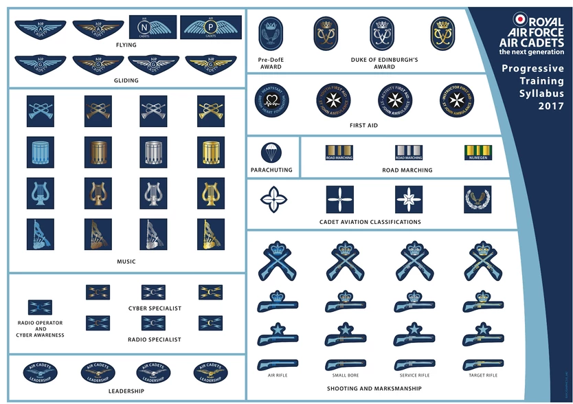

Achievements
============

In cadets there is a wide variety of achievements up for grabs.
If you have hobbies or activities that you do with or within school or cadets then they can be applied in cadets and some badges are even given for things like playing a musical instrument.

Below are some of the badges achievable in the ATC;

You can earn certain badges progressively throughout your time in the ATC. Certain badges may have age restrictions depending on what the courses involve.The badjes range from blue to gold in the subjective area and the coures become gradualy harder as you progress through the syllabus.
